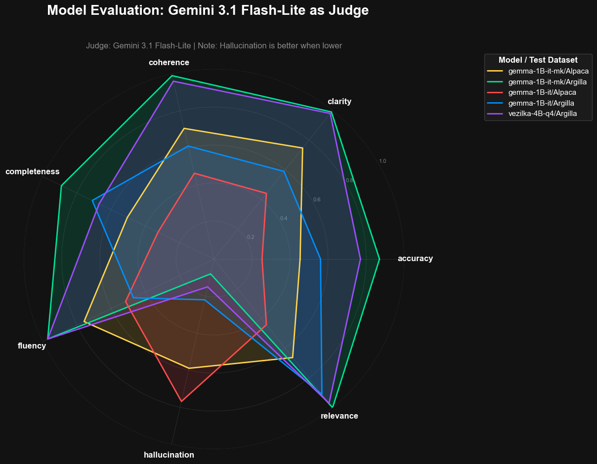
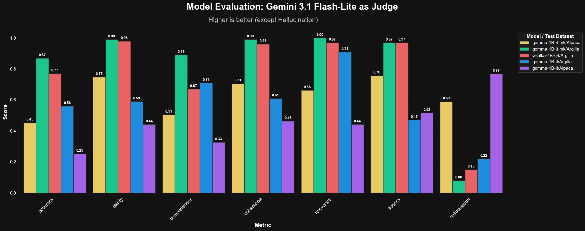
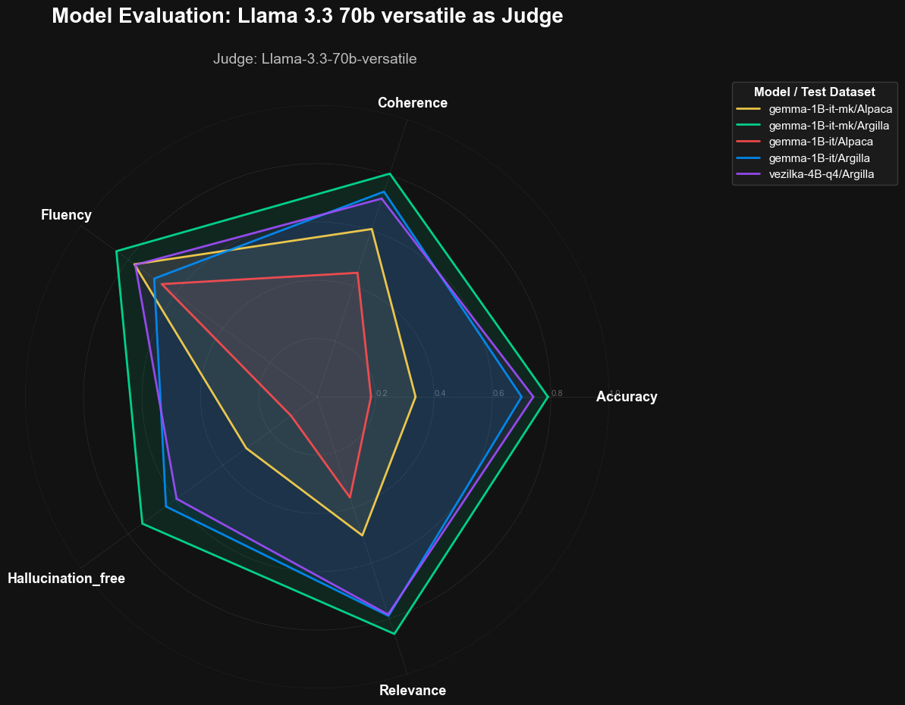
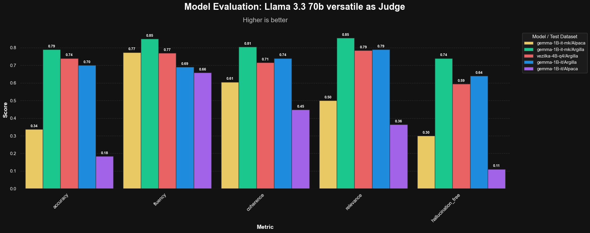

#  Evaluating gemma-3-1B-it-mk: LLM-as-a-Judge

> NOTE:
> This model was fine-tuned on the **Argilla** dataset to enhance instruction-following performance in Macedonian.

### 📈 Benchmarking Performance
We utilized a dual-judge system to minimize bias and capture a broader range of qualitative metrics.

---

## 📋 Model Overview

| | |
|---|---|
| **Base model** | `google/gemma-3-1b-it` |
| **Fine-tune dataset** | Argilla-MK |
| **Judge models** | Gemini 3.1 Flash-Lite · Llama 3.3 70B Versatile (`llama-3.3-70b-versatile`) |
| **Evaluation sets** | Alpaca (19 examples) · Argilla (20 examples) |
| **Gemini Metrics** | Accuracy · Fluency · Coherence · Relevance · Hallucination · Clarity · Completness  |
| **LLama Metrics** | Accuracy · Fluency · Coherence · Relevance · Hallucination Free |

---

> NOTE: In the charts the model that was finetuned with macedonian datasets is named `gemma-1B-it-mk`

---

### 📊 Gemini Judge Findings

| Model | Dataset | Accuracy | Fluency | Coherence | Relevance | Hall. Free | **Avg** |
| :--- | :--- | :---: | :---: | :---: | :---: | :---: | :---: |
| gemma-1B-it-mk | Alpaca | 0.45 | 0.76 | 0.71 | 0.66 | 0.41 | **0.598** |
| gemma-1B-it-mk | Argilla | 0.87 | 0.97 | 0.99 | 1.00 | 0.92 | **0.950** |
| vezilka-4B-q4 | Argilla | 0.77 | 0.97 | 0.96 | 0.97 | 0.85 | **0.904** |
| gemma-1B-it | Argilla | 0.56 | 0.47 | 0.61 | 0.91 | 0.78 | **0.666** |
| gemma-1B-it | Alpaca | 0.25 | 0.52 | 0.46 | 0.44 | 0.23 | **0.380** |
---

### 📊 Llama Judge Findings

| Model | Dataset | Accuracy | Fluency | Coherence | Relevance | Hall. Free | **Avg** |
| :--- | :--- | :---: | :---: | :---: | :---: | :---: | :---: |
| gemma-1B-it-mk | Alpaca | 0.34 | 0.77 | 0.61 | 0.50 | 0.30 | **0.504** |
| gemma-1B-it-mk | Argilla | 0.79 | 0.85 | 0.81 | 0.85 | 0.74 | **0.808** |
| vezilka-4B-q4 | Argilla | 0.74 | 0.77 | 0.71 | 0.79 | 0.59 | **0.720** |
| gemma-1B-it | Argilla | 0.70 | 0.69 | 0.74 | 0.79 | 0.64 | **0.712** |
| gemma-1B-it | Alpaca | 0.18 | 0.66 | 0.45 | 0.36 | 0.11 | **0.352** |
---
## 📝 Gemini 3.1 Flash-Lite Reasoning Examples

> If you want to see more complete reasoning on each row in the judged dataset click [here](stefan/gemma-3-1B-it-mk-eval/evaluation_results)

## Fine-tuned Gemma Tested on Alpaca
 
| # | Prompt | Expected | Model Response | Judge Reasoning |
|---|--------|----------|----------------|-----------------|
| 1 | Составете е-пошта со извинување на клиентот за доцнењет… | Тема: Извинување за доцна испорака  Почитуван [Customer… | Тема: Извини, доцнејќи по испорака  Почитуван/а [Име на… | The generated email contains significant grammatical errors and unnatural phrasing in Macedonian ('В… |
| 2 | Колку играчи има на теренот за време на редовен фудбалс… | За време на редовниот асоцијативен фудбалски (фудбалски… | На теренот за време на редовен фудбалски натпревар, има… | The response correctly identifies the total number of players (22). However, the sentence 'Овој број… |
| 3 | Транспонирајте го следниот сет на акорди од C-Major во … | Д, Ф#, А | Секако! Еве еден превод на сетот на акорди од C-Major в… | The generated output is factually incorrect. It incorrectly identifies the notes of C-Major and fail… |
| 4 | Ако 7^4x=343, која е вредноста на 7^4x-3? | Со оглед на 7^4x = 343, треба да ја најдеме вредноста н… | За да ја решиме вредноста на 7^4x-3, прво треба да ја и… | The generated response identifies the correct starting point but fails to complete the calculation. … |
 
## Fine-tuned Gemma Tested on Argilla
 
| # | Prompt | Expected | Model Response | Judge Reasoning |
|---|--------|----------|----------------|-----------------|
| 1 | Во контекст на деловен состанок, дајте совети за ефикас… | <<Совети за ефективна комуникација на деловни состаноци… | <<Ефективна комуникација во деловни состанови>>  *Комун… | The generated response failed to complete the sentence at the end. It also failed to include the exa… |
| 2 | Кои се клучните карактеристики на добро дизајнирана веб… | Добро дизајнираната веб-страница го дава приоритет на *… | * Добро дизајнираната веб-страница има јасна и концизна… | The generated response followed the constraints regarding bullet points and inclusion of keywords. H… |
| 3 | Вашиот одговор треба да содржи најмалку 3 реченици. Одг… | Кога избирате ново *место* што ќе го наречете дом во [г… | При избор на нов *дом* во *град*, важно е да земете пре… | The generated text failed to include the required bracketed placeholders (e.g., [адреса]), as it use… |
| 4 | Вашиот одговор треба да содржи помалку од 100 зборови. … | Главен град на Франција е Париз. Тоа е град познат по с… | Главен град на Франција е Париз. Тоа е познат по своите… | The generated response strictly follows all constraints, including the word count limit, the two-par… |

## Vezilka Tested on Argilla
 
| # | Prompt | Expected | Model Response | Judge Reasoning |
|---|--------|----------|----------------|-----------------|
| 1 | Во контекст на деловен состанок, дајте совети за ефикас… | <<Совети за ефективна комуникација на деловни состаноци… | Наслов: Совети за ефикасна комуникација во деловни сост… | The generated text followed most instructions, including using markdown for segments, length require… |
| 2 | Кои се клучните карактеристики на добро дизајнирана веб… | Добро дизајнираната веб-страница го дава приоритет на *… | * Корисничко искуство: Добро дизајнираната веб-страница… | The generated response failed to include the 3 required placeholders in square brackets. While it us… |
| 3 | Вашиот одговор треба да содржи најмалку 3 реченици. Одг… | Кога избирате ново *место* што ќе го наречете дом во [г… | *Важни фактори што треба да се земат предвид при изборо… | The generated response failed to include the required placeholders [дом] and [град], failed to use t… |
| 4 | Вашиот одговор треба да содржи помалку од 100 зборови. … | Главен град на Франција е Париз. Тоа е град познат по с… | Главниот град на Франција е Париз. Париз е познат по св… | The model correctly identified Paris as the capital, but failed the negative constraint requiring tw… |

## Base Gemma Tested on Alpaca
 
| # | Prompt | Expected | Model Response | Judge Reasoning |
|---|--------|----------|----------------|-----------------|
| 1 | Составете е-пошта со извинување на клиентот за доцнењет… | Тема: Извинување за доцна испорака  Почитуван [Customer… | Здравејте [Име на клиент],  Се надевам да сте добро.  В… | The generated text is completely unintelligible and grammatically incorrect in Macedonian. It uses w… |
| 2 | Колку играчи има на теренот за време на редовен фудбалс… | За време на редовниот асоцијативен фудбалски (фудбалски… | На терена за време на редовен фудбалски натпревар, игра… | The generated output is completely incorrect. It answers in Bulgarian instead of Macedonian, and the… |
| 3 | Транспонирајте го следниот сет на акорди од C-Major во … | Д, Ф#, А | Ето транзионирање на сет на акорди од C-Major во D-Majo… | The generated output is completely incorrect and nonsensical. It fails to transpose the chords from … |
| 4 | Ако 7^4x=343, која е вредноста на 7^4x-3? | Со оглед на 7^4x = 343, треба да ја најдеме вредноста н… | Нека $y = 7^4 x$. Значи, $y = 7^4 x = 2401 x$. Тенденци… | The generated output is completely incorrect. It misinterprets the mathematical expression 7^4x as 7… |
 
## Base Gemma Tested on Argilla
 
| # | Prompt | Expected | Model Response | Judge Reasoning |
|---|--------|----------|----------------|-----------------|
| 1 | Во контекст на деловен состанок, дајте совети за ефикас… | <<Совети за ефективна комуникација на деловни состаноци… | <<Песна на радостото>>  **Ефикасно комуникација во Дело… | The generated output follows most of the constraints, such as the double angular brackets title, the… |
| 2 | Кои се клучните карактеристики на добро дизајнирана веб… | Добро дизајнираната веб-страница го дава приоритет на *… | Се разбира, еве неколку карактеристики на добро дизајни… | The model failed to follow the formatting constraints. It used numbered lists instead of the require… |
| 3 | Вашиот одговор треба да содржи најмалку 3 реченици. Одг… | Кога избирате ново *место* што ќе го наречете дом во [г… | При избор на нов дом во [град], е потребно да се разгле… | The response followed all constraints: it contains at least 3 sentences, used placeholders [град] an… |
| 4 | Вашиот одговор треба да содржи помалку од 100 зборови. … | Главен град на Франција е Париз. Тоа е град познат по с… | Париз. | The response provided the correct answer, but it completely failed to follow the structural constrai… |
 