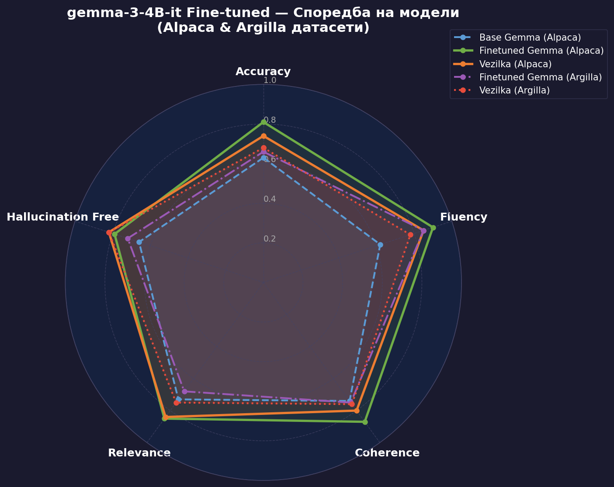
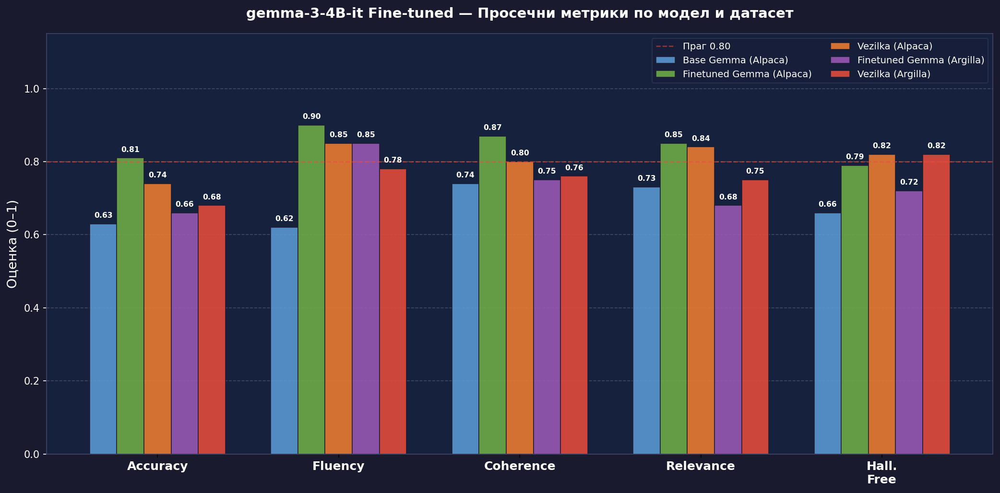
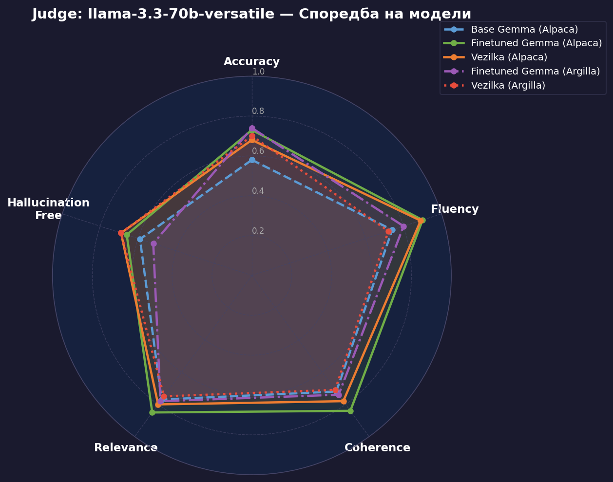
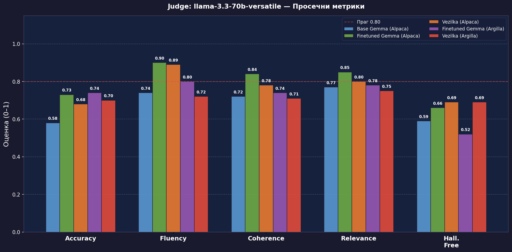

# Evaluating gemma-3-4B-it (Fine-tuned on Alpaca-MK): LLM-as-a-Judge

> This model was fine-tuned on the **Alpaca-MK** dataset to enhance instruction-following performance in **Macedonian**.
> Evaluation was performed using a **dual-judge system** (Claude Sonnet 4.6 + Llama 3.3 70B Versatile) across two test sets.

---

## 📋 Model Overview

| | |
|---|---|
| **Base model** | `google/gemma-3-4b-it` |
| **Fine-tune dataset** | Alpaca-MK |
| **Judge models** | Claude Sonnet 4.6 · Llama 3.3 70B Versatile (`llama-3.3-70b-versatile`) |
| **Evaluation sets** | Alpaca (19 examples) · Argilla (20 examples) |
| **Metrics** | Accuracy · Fluency · Coherence · Relevance · Hallucination Free |

---

## 📊 Results

### Judge: Claude Sonnet 4.6

| Model | Dataset | Accuracy | Fluency | Coherence | Relevance | Hall. Free | **Avg** |
|-------|---------|:--------:|:-------:|:---------:|:---------:|:----------:|:-------:|
| Base Gemma-3-4B-it | Alpaca | 0.63 | 0.62 | 0.74 | 0.73 | 0.66 | **0.676** |
| Finetuned Gemma-3-4B-it | Alpaca | 0.81 | 0.90 | 0.87 | 0.85 | 0.79 | **0.844** |
| Vezilka-4B | Alpaca | 0.74 | 0.85 | 0.80 | 0.84 | 0.82 | **0.810** |
| Finetuned Gemma-3-4B-it | Argilla | 0.66 | 0.85 | 0.75 | 0.68 | 0.72 | **0.732** |
| Vezilka-4B | Argilla | 0.68 | 0.78 | 0.76 | 0.75 | 0.82 | **0.758** |

---

### Judge: Llama 3.3 70B Versatile (`llama-3.3-70b-versatile`)

| Model | Dataset | Accuracy | Fluency | Coherence | Relevance | Hall. Free | **Avg** |
|-------|---------|:--------:|:-------:|:---------:|:---------:|:----------:|:-------:|
| Base Gemma-3-4B-it | Alpaca | 0.58 | 0.74 | 0.72 | 0.77 | 0.59 | **0.680** |
| Finetuned Gemma-3-4B-it | Alpaca | 0.73 | 0.90 | 0.84 | 0.85 | 0.66 | **0.796** |
| Vezilka-4B | Alpaca | 0.68 | 0.89 | 0.78 | 0.80 | 0.69 | **0.768** |
| Finetuned Gemma-3-4B-it | Argilla | 0.74 | 0.80 | 0.74 | 0.78 | 0.52 | **0.716** |
| Vezilka-4B | Argilla | 0.70 | 0.72 | 0.71 | 0.75 | 0.69 | **0.714** |

---

*Evaluation conducted with Claude Sonnet 4.6 and Llama 3.3 70B Versatile (`llama-3.3-70b-versatile`) as judges · Datasets: Alpaca-MK, Argilla-MK*