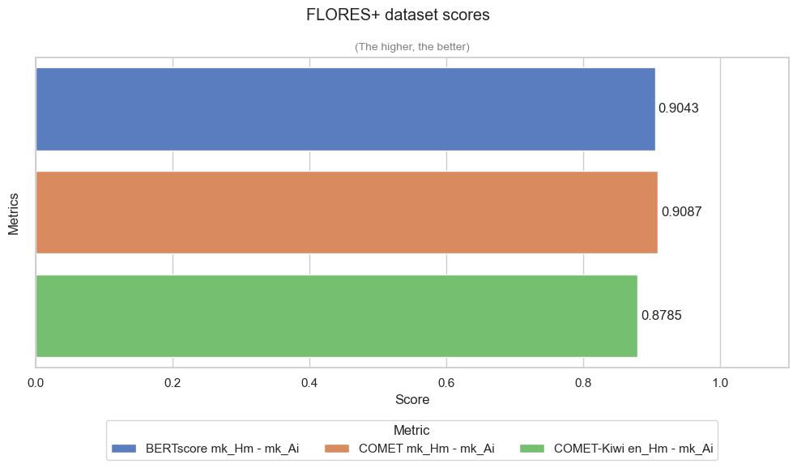
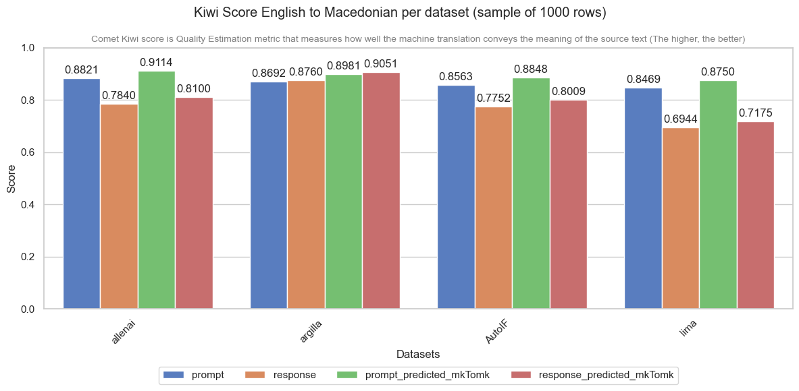

# TranslatingDatasets

## Translation Quality Evaluation

### 🥝 COMET/COMET-Kiwi (wmt22) Quality Level Table

 

| Score | Quality Level | Interpretation |
| :--- | :--- | :--- | 
| 0.90 – 1.00 | Excellent | Near-perfect translation |
| 0.80 – 0.89 | Good | High-quality fluent translation | 
| 0.70 – 0.79 | Fair | Understandable |
| 0.40 – 0.69 | Poor | Significant differance in context |
| < 0.40 | Fail | Completely inaccurate |

 

### 🌐 Google Translate: Dataset Results

 

