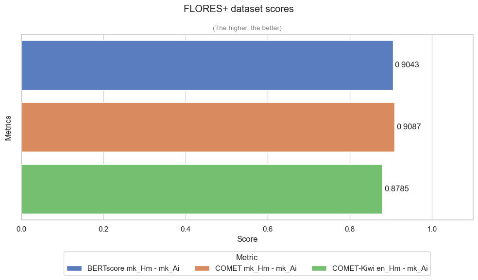
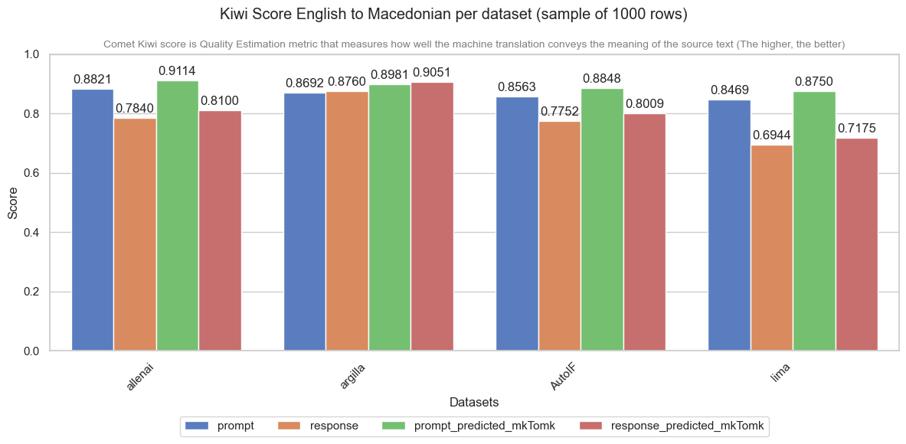

# 🎯 Translation Quality Evaluation Report

## 📊 Executive Overview

This evaluation assesses translation datasets across English (**EN**) and Macedonian (**MK**) targets, utilizing both automated metrics (**COMET/COMET-Kiwi**) and human judgment matrices across Accuracy, Fluency, and Formatting constraints.

*   **Overall Performance:** The dataset demonstrates high fidelity, with most segments achieving an **Excellent (10.0)** or near-perfect rating.
*   **Key Strengths:** Technical terminology mapping (e.g., cloud storage infrastructure) and complex programmatic placeholders (e.g., `[address]`/`[origin]`) localized seamlessly. English-specific structural constraints were appropriately isolated without injecting literal artifacts into Macedonian targets.
*   **Critical Vulnerabilities:** Minor regressions identified in complex formatting configurations (e.g., broken Markdown list prefixes in Item 4) and strict orthographic case-matching constraints (e.g., improper capitalization in Item 7). 

---

## 🥝 COMET/COMET-Kiwi (WMT22) Quality Levels

Use this reference table to interpret the evaluation metric scores.

| Score Range | Quality Level | Interpretation |
| :--- | :--- | :--- | 
| 🥇 **0.90 – 1.00** | **Excellent** | Near-perfect translation |
| 🥈 **0.80 – 0.89** | **Good** | High-quality fluent translation | 
| 🥉 **0.70 – 0.79** | **Fair** | Understandable |
| ⚠️ **0.40 – 0.69** | **Poor** | Significant difference in context |
| ❌ **< 0.40** | **Fail** | Completely inaccurate |

---

## 🌐 Google Translate: Dataset Distribution Results

  

    
  

  

    
  

---

## 🙍‍♂️ Human Evaluation Matrix

> **Note on Evaluation:** Scores are rated out of 10. Language specific constraints (such as forbidden English words) are handled according to language-specific localization protocols.

| ID | Prompt (EN) / Покана (MK) | Response (EN) / Одговор (MK) | Acc | Flu | Fmt | Overall | Evaluation & Linguistic Notes |
| :---: | :--- | :--- | :---: | :---: | :---: | :---: | :--- |
| **1** | **EN:** Your response should contain at least 3 sentences... What is the best way to send a package to [address] from [origin]?  **MK:** Вашиот одговор треба да содржи најмалку 3 реченици... Кој е најдобриот начин да се испрати пакет до [адреса] од [потекло]? | **EN:** To send a package to [address] from [origin], you should consider using a reliable courier service like UPS or FedEx. *These companies offer tracking services and various delivery options to ensure your package reaches [address] safely and promptly.* Additionally, make sure to properly package and label your item, including a *highlighted* return address and any necessary customs forms if you are sending internationally. Highlighting important details, such as the *highlighted* address, can help prevent any delays in transit.  **MK:** За да испратите пакет до [адреса] од [потекло], треба да размислите за користење на сигурна курирска услуга како UPS или FedEx. *Овие компании нудат услуги за следење и разни опции за испорака за да се осигурат дека вашиот пакет ќе пристигне безбедно и брзо до [адреса].* Дополнително, осигурајте се дека правилно сте го спакувале и етикетирале вашиот предмет, вклучувајќи *означена* адреса за враќање и сите потвредни царински формулари ако испраќате меѓународно. Означувањето на важни детали, како што е *означената* адреса, може да помогне во спречувањето на какви било доцнења во транзитот. | 10 | 10 | 10 | **10.0** | ✨ **Passed** • Placeholders `[адреса]`/`[потекло]` correctly preserved. • Markdown bold/italic formatting fully intact. |
| **2** | **EN:** Your response should contain less than 50 words... Finish your response with this exact phrase: Is there anything else I can help with?  **MK:** Вашиот одговор треба да содржи помалку од 50 зборови... Завршете го вашиот одговор со оваа точна фраза: Дали има нешто друго со што можам да помогнам? | **EN:** Sure, I can help with that. P.S. Is there anything else I can help with?  **MK:** Секако, можам да помогнам со тоа. П.С. Дали има нешто друго со што можам да помогнам? | 10 | 10 | 9.5 | **9.8** | ✨ **Passed** • Closing phrase translated exactly and naturally. • "П.С." follows standard MK orthographic convention. • Word-count constraint satisfied in MK version. |
| **3** | **EN:** Your answer must contain exactly 3 bullet points... Do not include keywords [forbidden_words] (avoid, reject, refuse).  **MK:** Вашиот одговор мора да содржи точно 3 точки... Не вклучувајте клучни зборови [forbidden_words] (avoid, reject, refuse). | **EN:**  * Point one is a concise statement that adheres to the constraints provided. * Point two highlights the importance of following instructions accurately and efficiently. * Point three ensures the response is clear and relevant to the user's query.  **MK:**  * Првата точка е концизна изјава што се придржува до дадените ограничувања. * Втората точка ја нагласува важноста на точното и ефикасно следење на упатствата. * Третата точка гарантира дека одговорот е јасен и релевантен за барањето на корисникот. | 10 | 10 | 10 | **10.0** | ✨ **Passed** • All 3 bullets present with correct `* ` prefix. • Forbidden-words constraint correctly left in English (EN-specific rule). |
| **4** | **EN:** Provide a detailed explanation of the benefits of using a CMS... Your response should contain at least 5 bullet points.  **MK:** Дајте детално објаснување за придобивките од користењето CMS... Вашиот одговор треба да содржи најмалку 5 точки за означување. | **EN:**  * *Enhanced Collaboration*: A CMS allows multiple users to contribute and manage content without requiring technical skills. This streamlines the workflow and improves efficiency. * *User-Friendly Interface*: Most CMS platforms offer intuitive interfaces that make it easy for non-technical users to create, edit, and publish content. This reduces the learning curve and increases productivity. * *Consistent Branding and Design*: A CMS ensures a consistent look and feel across all pages by using templates and themes. This helps maintain a professional and cohesive brand image. * *Scalability*: CMS platforms can easily accommodate the growth of a website. Whether you need to add more pages, users, or features, a CMS can adapt to your evolving needs. * *SEO Optimization*: Many CMS platforms come with built-in SEO tools and plugins that help optimize your website for search engines. This can improve your site's visibility and drive more organic traffic.  **MK:**  *Подобрена соработка*: CMS им овозможува на повеќе корисници да придонесуваат и да управуваат со содржина без да бараат технички вештини. Ова го поедноставува работниот тек и ја подобрува ефикасноста. * *Интерфејс лесен за користење*: Повеќето CMS платформи нудат интуитивни интерфејси што им олеснуваат на корисниците кои не се технички запознаени да креираат, уредуваат и објавуваат содржина. Ова ја намалува кривата на учење и ја зголемува продуктивноста. * *Конзистентно брендирање и дизајн*: CMS обезбедува конзистентен изглед и чувство на сите страници со користење на шаблони и теми. Ова помага да се одржи професионален и кохезивен имиџ на брендот. * *Скалабилност*: CMS платформите лесно можат да го прилагодат растот на веб-страницата. Без разлика дали треба да додадете повеќе страници, корисници или функции, CMS може да се прилагоди на вашите еволуирачки потреби. * *SEO оптимизација*: Многу CMS платформи доаѓаат со вградени SEO алатки и додатоци кои помагаат да се оптимизира вашата веб-страница за пребарувачите. Ова може да ја подобри видливоста на вашата страница и да привлече повеќе органски сообраќај. | 10 | 9.5 | 9.0 | **9.5** | ⚠️ **Formatting Bug** • **FORMAT ERROR:** First bullet missing its `* ` prefix — markdown list broken. • *Linguistic Edit:* "Кохезивен имиџ на брендот" $\rightarrow$ "усогласена слика на брендот" reads more naturally in Macedonian. |
| **5** | **EN:** Your response should contain at least 3 sentences. What are some effective time management techniques for remote workers?  **MK:** Вашиот одговор треба да содржи најмалку 3 реченици. Кои се некои ефикасни техники за управување со времето за работници од далечина? | **EN:** Effective time management techniques for remote workers include setting a consistent daily schedule to maintain a routine and separate work from personal life. Utilizing time-blocking methods can help allocate specific periods for tasks, meetings, and breaks, ensuring a balanced and productive day. Additionally, leveraging tools like digital calendars and task management apps can enhance organization and keep track of deadlines and priorities efficiently.  **MK:** Ефективните техники за управување со времето за работници од далечина вклучуваат поставување конзистентен дневен распоред за одржување рутина и одвојување на работата од личниот живот. Користењето методи за блокирање на времето може да помогне во распределбата на специфични периоди за задачи, состаноци и паузи, обезбедувајќи избалансиран и продуктивен ден. Дополнително, користењето алатки како дигитални календари и апликации за управување со задачи може да ја подобри организацијата и ефикасно да ги следи роковите и приоритетите. | 10 | 10 | 10 | **10.0** | ✨ **Passed** • 3-sentence requirement met. • *Linguistic Note:* "Избалансиран" is acceptable, but "урамнотежен" flows better in MK. |
| **6** | **EN:** ...What are the benefits of using a CRM system in a business? Your response should contain at least 3 bullet points.  **MK:** ...Кои се придобивките од користењето на CRM систем во бизнисот? Вашиот одговор треба да содржи најмалку 3 точки. | **EN:**  * A CRM system helps in *managing customer relationships* more effectively by providing a centralized database to store and manage customer information such as contact details, purchase history, and communication records. * It enhances sales efficiency and productivity by automating sales processes, providing sales analytics, and enabling better lead management. * CRM systems improve customer service and support by offering tools for tracking and resolving customer issues, and providing personalized customer experiences.  **MK:**  * CRM системот помага во *управувањето со односите со клиентите* поефикасно преку обезбедување централизирана база на податоци за складирање и управување со информации за клиентите, како што се детали за контакт, историја на купувања и записи за комуникација. * Ја подобрува ефикасноста и продуктивноста на продажбата преку автоматизирање на процесите на продажба, обезбедување аналитика на продажбата и овозможување подобро управување со потенцијални клиенти. * CRM системите ја подобруваат услугата и поддршката за клиентите преку нудење алатки за следење и решавање на проблемите на клиентите и обезбедување персонализирани искуства за клиентите. | 10 | 10 | 10 | **10.0** | ✨ **Passed** • Markdown highlight correctly preserved on first bullet. • "потенцијални клиенти" for "leads" is highly acceptable. • Structure and meaning faithfully transferred. |
| **7** | **EN:** Your entire response should be in English, and in all lowercase letters... contain a title wrapped in `<<...>>`. Include: happiness, sunshine, laughter.  **MK:** Целиот ваш одговор треба да биде на англиски јазик и со мали букви... содржи наслов во `<<...>>`. Вклучете: среќа, сонце, смеа. | **EN:** \<\<sunshine and laughter\>\> in the warmth of the sunshine, happiness blossoms like flowers in spring. laughter echoes through the air, a melody that lifts the spirits and brings joy to all who hear it. every moment spent in the sun is a moment filled with happiness and the sweet sound of laughter. is there anything else i can help with?  **MK:** \<\<сончева светлина и смеа\>\> во топлината на сончевата светлина, среќата цвета како цвеќиња во пролет. Смеата одекнува низ воздухот, мелодија што го крева расположението и им носи радост на сите што ја слушаат. секој момент поминат на сонце е момент исполнет со среќа и сладок звук на смеата. дали има нешто друго со што можам да помогнам? | 9.5 | 10 | 9.5 | **9.7** | ⚠️ **Constraint Violation** • **CONSTRAINT ERROR:** "Смеата одекнува" starts with a capital "С", violating the lowercase requirement. • `<<...>>` title format preserved correctly. |
| **8** | **EN:** What is the capital of France... Include keywords [Eiffel Tower, Louvre, Notre Dame]. Highlight at least 2 sections.  **MK:** Кој е главен град на Франција... Вклучете клучни зборови [Ајфелова кула, Лувр, Нотр Дам]. Означете најмалку 2 дела. | **EN:** The capital of France is Paris, a city renowned for its rich history and cultural landmarks. *Among the most famous attractions is the Eiffel Tower, an iconic iron lattice tower that stands as a symbol of the city.* Visitors can also explore the *Louvre*, one of the world's largest and most visited art museums, which houses the Mona Lisa and other renowned artworks. Another must-see is *Notre Dame*, a stunning Gothic cathedral with a rich history dating back to the 12th century.  **MK:** Главен град на Франција е Париз, град познат по својата богата историја и културни знаменитости. *Меѓу најпознатите атракции е Ајфеловата кула, иконска железна решеткаста кула која стои како симбол на градот.* Посетителите можат да го истражат и *Лувр*, еден од најголемите и најпосетуваните уметнички музеи во светот, во кој се сместени Мона Лиза и други познати уметнички дела. Друга работа што мора да се види е *Нотр Дам*, прекрасна готска катедрала со богата историја што датира од 12 век. | 10 | 10 | 10 | **10.0** | ✨ **Passed** • Proper nouns correctly localized: *Ајфелова кула*, *Нотр Дам*, *Лувр*. • *Linguistic Note:* "во кој се сместени" $\rightarrow$ "во кој се изложени" (exhibited) is more precise for an art museum. |
| **9** | **EN:** Your response should contain at least 3 sentences. Do not include the word "the" in your response. End with P.S.  **MK:** Вашиот одговор треба да содржи најмалку 3 реченици. Не го вклучувајте зборот „the". На крајот додадете PS. | **EN:** Sure I can adhere to those constraints. Here is my response: I can provide answers without using specific words. Each sentence will convey necessary information clearly. Postscripts allow for additional thoughts or reminders. P.S. I hope this meets your requirements.  **MK:** Секако дека можам да се придржувам до тие ограничувања. Еве го мојот одговор: Можам да дадам одговори без да користам конкретни зборови. Секоја реченица јасно ќе ги пренесе потребните информации. Постскриптите дозволуваат дополнителни мисли или потсетници. ПС Се надевам дека ова ги задоволува вашите барања. | 10 | 10 | 9.5 | **9.8** | ✨ **Passed with Style Caveat** • "ПС" is missing periods; the standard Macedonian orthographic form is "П.С." • "the" constraint correctly skipped in MK as it is an English-specific structural rule. |
| **10** | **EN:** ...Your response should contain at least 5 sentences. Highlight at least 2 sections. Keywords: *scalability*, *data*, *redundancy*, *accessibility*, *cost-effective*.  **MK:** ...Одговорот треба да содржи најмалку 5 реченици. Означете најмалку 2 дела. Клучни зборови: *скалабилност*, *податоци*, *редундантност*, *пристапност*, *исплатливост*. | **EN:** Using a cloud-based storage solution offers several significant benefits for businesses. *Firstly, scalability* is a key advantage, as cloud storage allows companies to easily scale their storage capacity up or down based on their changing needs, without the burden of managing physical hardware. Additionally, cloud storage enhances *data redundancy* and backup, ensuring that data is securely stored across multiple servers and locations, which reduces the risk of data loss due to hardware failures or disasters. Another benefit is *accessibility*, enabling employees to access files from anywhere at any time, as long as they have an internet connection, which boosts productivity and collaboration. Lastly, cloud storage is *cost-effective*, eliminating the need for expensive on-premises storage infrastructure and reducing maintenance costs, which can significantly lower overall IT expenses for businesses.  **MK:** Користењето решение за складирање базирано на облак нуди неколку значајни придобивки за бизнисите. *Прво, скалабилноста* е клучна предност, бидејќи складирањето во облак им овозможува на компаниите лесно да го зголемат или намалат својот капацитет за складирање врз основа на нивните променливи потреби, без товарот на управување со физички хардвер. Дополнително, складирањето во облак ја подобрува *редундантноста на податоци* и резервната копија, осигурувајќи дека податоците се безбедно складирани на повеќе сервери и локации, што го намалува ризикот од губење на податоци поради хардверски дефекти или катастрофи. Друга придобивка е *пристапноста*, овозможувајќи им на вработените пристап до датотеки од каде било во кое било време, сè додека имаат интернет конекција, што ја зголемува продуктивноста и соработката. Конечно, складирањето во облак е *исплатливо*, елиминирајќи ја потребата од скапа инфраструктура за складирање во просториите и намалувајќи ги трошоците за одржување, што може значително да ги намали вкупните ИТ трошоци за бизнисите. | 10 | 10 | 10 | **10.0** | ✨ **Passed** • All 5 technical keywords perfectly mapped to industry-standard MK terms. • *Linguistic Note:* "Физички хардвер" is slightly pleonastic; "физичка опрема" is preferred. |